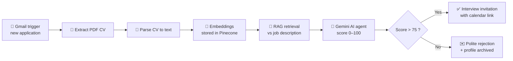

<h1 align="center">🤖 AI Smart Recruiter</h1>

  <b>An AI recruitment agent that reads applications from a mailbox, screens each CV against the job description, 
  scores the candidate and replies automatically — built with n8n, Google Gemini and Pinecone (RAG).</b>

  
  
  
  
  

  

---

## The problem

Recruiters spend a large share of their time on repetitive first-round tasks: opening application emails, downloading CVs, reading them against the job description, and answering every candidate. On high-volume positions this slows down the process and many candidates never get a reply.

## The solution

**AI Smart Recruiter** automates this first screening round from end to end. It watches a Gmail inbox, extracts the CV from each application, compares it with the job description using retrieval-augmented generation (RAG), gives the candidate a score out of 100 and sends the right email — an interview invitation or a polite rejection — without manual work.

I designed and built this workflow myself to explore how LLM agents and vector search can be applied to a real business process.

## How it works

| Step | What happens |
|---|---|
| **1. Sourcing** | A Gmail trigger detects incoming emails containing "Application" or other configured keywords and extracts the PDF attachment. |
| **2. Parsing** | The PDF resume is converted into machine-readable text. |
| **3. Vector storage** | The CV content is embedded and stored in a **Pinecone** index. |
| **4. Screening (RAG)** | The agent retrieves the candidate's most relevant experience for the job description instead of reading the whole CV blindly. |
| **5. Scoring** | A **Google Gemini** agent evaluates hard-skills and soft-skills match and returns a score from 0 to 100. |
| **6. Decision & reply** | Above 75: interview invitation with a calendar link. Otherwise: polite rejection email and the profile is archived. |

## What this project demonstrates

- **Process automation** — mapping a real business process (first-round recruitment screening) and turning it into a reliable automated workflow.
- **Applied generative AI** — designing an LLM agent, writing and tuning its system prompt, and structuring its output into a usable score.
- **RAG architecture** — using embeddings and a vector database (Pinecone) to ground the AI's evaluation in the candidate's actual experience.
- **API integration** — connecting Gmail (OAuth2), Pinecone and the Gemini API inside a single n8n pipeline.
- **Business logic** — threshold-based decisions and automatic, personalised candidate communication.

## Tech stack

| Layer | Tool |
|---|---|
| Orchestration | n8n |
| Language model | Google Gemini |
| Vector database | Pinecone |
| Email in / out | Gmail API (OAuth2) |
| Input format | PDF resumes |

## Getting started

### 1. Import the workflow
- Download **[AI Smart Recruiter.json](https://github.com/user-attachments/files/24028425/AI.Smart.Recruiter.json)**.
- In n8n, go to **Workflows → Import from File** and select the file.

### 2. Configure credentials
The nodes stay red until these are set up in n8n:
- **Gmail OAuth2** — to read applications and send replies
- **Pinecone API** — for vector storage
- **Google Gemini API** — for the AI agent

### 3. Adapt it to your job offer
- Open the **AI Agent** node and edit the system prompt with your own job description, or connect a Google Docs node to load job offers dynamically.
- Adjust the score threshold (75 by default) in the decision node to match how selective the position is.

## Responsible use

Automated screening affects real people, so the workflow is meant to **assist** recruiters, not replace their judgement:

- Review the AI's scores regularly and keep a human validation step before rejections on sensitive positions.
- Write the job description around skills and experience only, to avoid introducing bias through the prompt.
- CVs contain personal data: inform candidates that their application is processed automatically, and delete stored embeddings when they are no longer needed, in line with applicable data-protection rules (GDPR in Europe, law 09-08 in Morocco).

## Possible improvements

- Human-in-the-loop approval before sending emails
- Automatic interview scheduling through Google Calendar
- Dashboard of candidates and scores in Google Sheets
- Support for several open positions at the same time

## Author

**Omar Grif** — engineering student at EMINES – UM6P (Ben Guerir, Morocco)
GitHub: [@omargrif](https://github.com/omargrif)

Free to use and adapt for your own automation projects.
